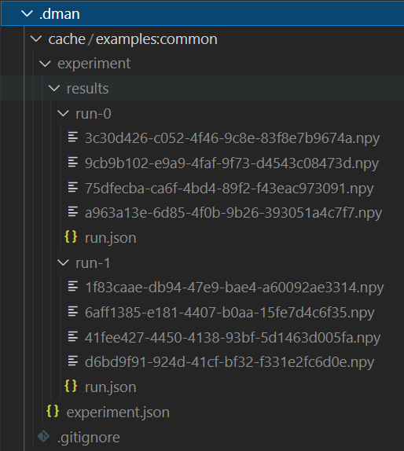

.. _common-use:

Getting Started
========================
We provide an example here of how one could approach. This example will show you

* How to integrate ``numpy`` arrays into the framework.
* How to setup an experiment modelclass.
* How to save and load from cache.

The full script is as follows:

.. code-block:: python

    from dman import modelclass, track, load
    from dman import mruns_factory, mruns
    from dman.numeric import barray, barrayfield

    import numpy as np

    @modelclass(name='config')
    class Configuration:
        seed: int = 1234
        size: int = 20
        nsample: int = 1000
        nrepeats: int = 2

    @modelclass(name='run', storable=True)
    class Run:
        config: Configuration
        data: barray = barrayfield(default=None)
        output: barray = barrayfield(default=None)

    def execute(cfg: Configuration):
        with track('experiment', default_factory=mruns_factory(stem='run', subdir='results')) as content:
            content: mruns = content
            if len(content) > 0 and any((run.config == cfg for run in content)):
                return

            rng = np.random.default_rng(cfg.seed)
            data = rng.random(size=(cfg.size, cfg.nsample))
            transform = rng.standard_normal(size=(100, data.shape[0]))
            output = transform @ data
            content.append(Run(cfg, data, output))            
        

    def main():    
        with track('experiment' , default_factory=mruns_factory(stem='run', subdir='results')) as content:
            content: mruns = content
            content.clear()
        
        execute(Configuration(seed=1000))
        execute(Configuration(seed=1024))
        execute(Configuration(seed=1000))

        content: mruns = load('experiment')
        for run in content:
            print(run)

    if __name__ == '__main__':
        main()

    

Setting up
------------------------

To setup the example we will need to following imports:

.. code-block:: python

    from dman import modelclass, track, load, storable, save
    from dman import recordfield, mruns_factory, mruns

    from dataclasses import field
    import numpy as np

The first step is to describe how arrays are stored. We do so by 
creating a ``storable`` type. 

.. code-block:: python

    @storable(name='_num__barray')
    class barray(np.ndarray):
        __ext__ = '.npy'

        def __write__(self, path):
            with open(path, 'wb') as f:
                np.save(f, self)

        @classmethod
        def __read__(cls, path):
            with open(path, 'rb') as f:
                res: np.ndarray = np.load(f)
                return res.view(cls)

We specify three components. First ``__ext__`` specifies the suffix added
to the created files. The ``__write__`` defines how to store the content 
at a specified path and similarly ``__read__`` defines how to read 
the content from a file. 

It will be inconvenient to always call ``data.view(barray)`` to convert 
data to the storable type. To make this more convenient we can 
create a wrapper around ``recordfield``:

.. code-block:: python

    def barrayfield(**kwargs):
        def to_sarray(arg):
            if isinstance(arg, np.ndarray):
                return arg.view(barray)
            return arg                
        return recordfield(**kwargs, pre=to_sarray)

The callable provided through the ``pre`` argument is called whenever 
a field is set in a ``modelclass``.

.. note:: 

    Both ``barray`` and ``barrayfield`` are implemented in ``dman.numeric``.
    We provide the details here since they are a good example on how 
    to implement a ``storable`` type. 

We will want to do multiple runs of some test in this example, so first 
lets specify the run type.

.. code-block:: python

    @modelclass(name='run', storable=True)
    class Run:
        config: Configuration
        data: barray = barrayfield(default=None)
        output: barray = barrayfield(default=None)

Simple enough. A run is a ``modelclass``, which is like a ``dataclass``,
but with some additional features enabling it to be stored automatically. 
We specify that the ``modelclass`` can be stored to a file using ``storable=True``. 

The run contains two fields: ``input`` and ``output``. Note 
that these are specified using a ``recordfield``, 
which has all options from the ``field`` method. We use this method since 
the ``sarray`` fields should be stored. The ``recordfield`` makes this 
clear and enables specifying things like the filename, subdirectory, etc. 
We leave these unspecified in this case and leave filename selection to 
the ``dman`` framework. 

The ``execute`` method simply takes some input, a random generator and 
produces an output using some random transformation matrix. Both 
the input and output are converted to ``sarray`` and stored. 

Next we want to define the experiment configuration:

.. code-block:: python

    @modelclass(name='config')
    class Configuration:
        seed: int = 1234
        size: int = 20
        nsample: int = 1000     
        nrepeats: int = 2

We will store our data in an instance of ``mruns``, which acts like 
a list. File names are determined automatically based on the specified stem.

For example we can specify to store items at ``results/experiment-#``
with ``#`` replaced by the number of the run.

.. code-block:: python
    
    content = mruns(stem='run', subdir='results')

.. warning::

    To avoid unnecessary overhead caused by having to move files around,
    the index used in the file name is not the index in the list. Instead 
    it is based on a counter that keeps track of the number of runs added. 
    This matches the index until items are deleted or inserted. 
        

Running the experiment
----------------------------------
We implement a method to run the experiment given some configuration:

.. code-block:: python

    with track('experiment' , default_factory=mruns_factory(stem='run', subdir='results')) as content:
        content: mruns = content
        if len(content) > 0 and any((run.config == cfg for run in content)):
            return

        rng = np.random.default_rng(cfg.seed)
        data = rng.random(size=(cfg.size, cfg.nsample))
        transform = rng.standard_normal(size=(100, data.shape[0]))
        output = transform @ data
        content.append(Run(cfg, data, output))            
    

We provide an overview of the above code segment:

1. The ``track`` command
    It specifies a file key, based on which an object will be loaded.
    If the file does not exist, it will be created based on ``default_factory``.
    Similarly to ``load`` it specifies a file key and a default value that is used when the object can 
    not be loaded from the file key. Once the context exists, the file is saved automatically.

2. The ``mruns_factory`` method
     Returns a method with no arguments that returns ``mruns(stem='experiment', subdir='results')`` when called.

3. Note that we specify the loaded type.
    The interpreter can not know in advance what the loaded type will be, so we specify 
    it manually. This is good practice since it makes refactoring more convenient. It also avoids 
    issues caused by loading stored objects when the class definition is not imported. 

4. We check if the config is new.
    To avoid re-running experiments unnecessarily we go through the list of 
    experiments and check whether the config was already executed. Note that 
    no data arrays are loaded from disk when doing so because of the deferred
    loading supported by default through the ``record`` system.

.. warning::

    Before running the script execute ``dman init`` in the root folder 
    of your project. Files will be stored in the ``.dman`` folder created there. 

We execute three experiments as follows:

.. code-block:: python

    execute(Configuration(seed=1000))
    execute(Configuration(seed=1024))
    execute(Configuration(seed=1000))

Afterwards you will see that ``.dman`` is populated as follows:

Note that the ``experiment`` folder is ignored by default. 
The root file is ``experiment.json`` (as specified by the key in ``track``). 
Its content is as follows

.. code-block:: json

    {
        "_ser__type": "_ser__mruns",
        "_ser__content": {
            "stem": "run",
            "run_count": 2,
            "store": [
                {
                    "_ser__type": "_ser__record",
                    "_ser__content": {
                        "target": "results/run-0/run.json",
                        "sto_type": "run"
                    }
                },
                {
                    "_ser__type": "_ser__record",
                    "_ser__content": {
                        "target": "results/run-1/run.json",
                        "sto_type": "run"
                    }
                }
            ],
            "subdir": "results"
        }
    }

Note that the ``results`` are not 
recorded here directly. Instead we have a ``_ser__record`` that 
specifies the location of the json files relative to the file ``experiment.json``. 

We can see the options passed to ``mruns_factory``.
Moreover, all of the run keys are there, but their content 
defers to another file through a ``_ser__record`` field. 
Specifically ``'results/run-#/run.json'``. You see that the ``run-#.json`` files contain 
info about the files containing the ``barray`` types. These file names 
are specified automatically using ``uuid4`` to guarantee uniqueness.

The Configuration File
------------------------------

Since the configuration is serializable we can also save and load it to disk.

We can create a configuration file using the ``save``
command. 

.. code-block:: python

    save('config', Configuration(), cluster=False)

We add the ``cluster=False`` since the Configuration only needs a single file. So no dedicated subfolder (i.e. cluster) should be created.

You should see a ``config.json`` file appear in your ``.dman`` folder. 
You can re-run the code above, after tweaking some values. The experiment
behavior changes. 

We can load it from disk using 

.. code-block:: python

    cfg: Configuration = load('config', cluster=False)

It is important that ``cluster=False`` is added here as well. Note that internally 
the ``track`` command uses both ``load`` and ``save``.

Clearing the Experiments
-------------------------------

To clear all experiments we can execute the following snippet:

.. code-block:: python

    with track('experiment' , default_factory=mruns_factory(stem='experiment', subdir='results')) as content:
        content: mruns = content
        content.clear()

Alternatively if you wish to remove only the most recent run you can use:

.. code-block:: python

    with track('experiment' , default_factory=mruns_factory(stem='experiment', subdir='results')) as content:
        content: mruns = content
        content.pop()

The files are only removed once the ``track`` context exits.

Specifying Storage Folder
-------------------------------

In the above experiment, the files were stored in
a folder called ``cache/examples:common``. The folder name 
was created based on the script path relative to the folder in which 
``.dman`` is contained. Specifically the script was located in ``examples/common.py``. 

The automatic folder name generation is implemented to avoid potential overlap
between different scripts. Of course, this also means that using 
``track('experiment')`` in two different scripts will save/load from different
files. If you want to use files in different scripts you can do so by specifying 
a ``generator`` as follows

.. code-block:: python

    with track('experiment', default_factory=Experiment, generator='demo') as content:

Doing this, will save/load files from the folder ``.dman/demo`` no matter 
what script the command is executed from. Other options are listed in :ref:`fundamentals`.